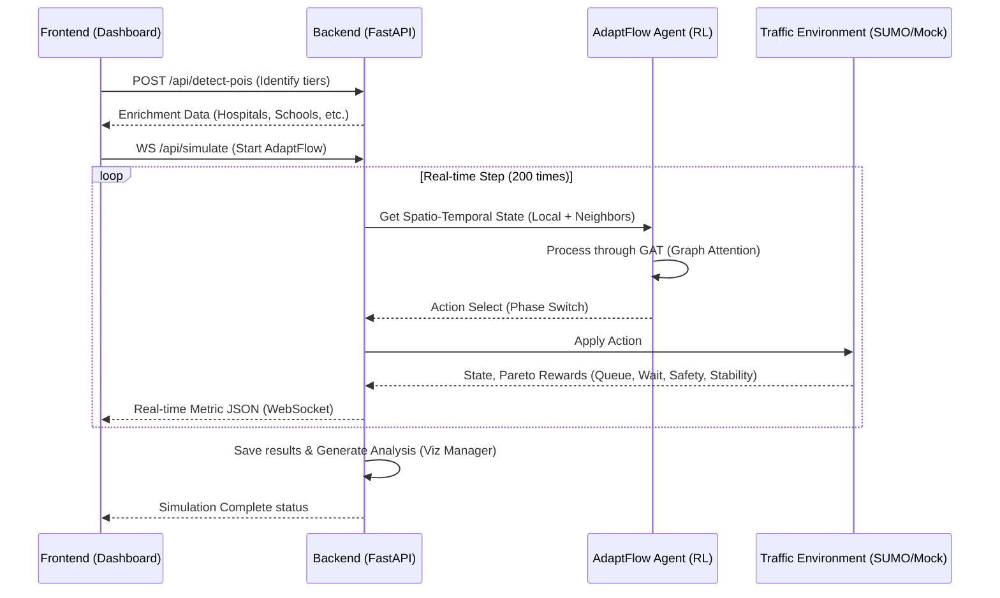

# AdaptFlow Simulation Flow

This document explains the end-to-end flow of the Smart Traffic Control project when a simulation is triggered using the **AdaptFlow** algorithm.

## 🔄 High-Level Flow Architecture

---

## 🏗️ Step-by-Step Breakdown

### 1. Frontend: Triggering & Enrichment
When you click **Start Simulation**, the frontend (`App.jsx`) performs two actions:
*   **POI Detection**: It sends your intersection coordinates to `/api/detect-pois`. The backend identifies nearby "Points of Interest" (like hospitals or schools) and assigns **Priority Tiers** (e.g., Tier 1 for critical nodes).
*   **WebSocket Initialization**: It opens a persistent connection to `/api/simulate`.

### 2. Backend: Orchestration (`server.py`)
The `run_adaptflow_simulation` function takes over:
*   **Lazy Loading**: It imports `AdaptFlowTrainer` only when needed to optimize startup time.
*   **Environment Setup**: It creates a cluster of environments (one per intersection), which are "wired" together so they can share traffic flow data.

### 3. The AdaptFlow Core Logic
AdaptFlow differs from standard algorithms (like FedAvg) through two key innovations:

#### A. Spatio-Temporal Graph State
Unlike simple RL agents that only see their own intersection, the AdaptFlow agent sees a **Graph State**:
*   It combines its local status with the status of its neighbors.
*   It uses a **GAT (Graph Attention Transformer)** to "pay attention" to incoming traffic from busy neighbors before it even arrives.

#### B. Dynamic Re-Clustering
During training, the `AdaptiveClusterManager` groups intersections based on their **Congestion Fingerprints**. 
> [!TIP]
> This ensures that an intersection in a light suburban area doesn't "pollute" the learning of an intersection in a heavy downtown area.

#### C. Prioritized Experience Replay (PER)
The agent doesn't learn from all experiences equally. It uses a **PER Buffer** to focus on "meaningful" traffic events—like resolving a major bottleneck—by prioritizing them during training.

#### D. Pareto Reward Multi-Objective Optimization
The environment calculates rewards based on four factors:
1.  **Queue Length**: Minimizing total vehicle backup.
2.  **Waiting Time**: Reducing individual vehicle delay.
3.  **Safety**: Heavily penalizing accidents or near-misses.
4.  **Stability**: Penalizing excessive or erratic signal switching.

### 4. Real-time Feedback
Every **0.1 seconds**, the backend sends a JSON payload back to your dashboard. This includes:
*   Sub-second rewards for each node.
*   Accumulated safety scores.
*   Global averages for the entire city.

## 📡 The Role of TomTom

TomTom acts as the "Ground Truth" for your simulation in two distinct ways:

1.  **Historical Pattern Monitoring**: A background task (`traffic_data_collector`) periodically hits the TomTom API during specific slots (e.g., Rush Hour). This data builds a fingerprint of how the city *actually* behaves, which is used to train the AdaptFlow model to handle real-world congestion surges.
2.  **Live Environment Seeding**: When `use_tomtom` is enabled in your simulation config:
    *   The environment fetches real-time `currentSpeed` and `freeFlowSpeed` from the TomTom Flow API.
    *   It calculates the **Congestion Score** using this formula:
        > $$Congestion Score = \min\left(3.0, \frac{Free Flow Speed}{Current Speed}\right)$$
    *   **Interpretation**: 
        *   **1.0**: Perfect flow (Current Speed = Free Flow Speed).
        *   **2.0**: Moderate delay (Current Speed is half of Free Flow Speed).
        *   **3.0 (Cap)**: Heavy congestion (Traffic is at a standstill or crawling).
    *   This ratio scales the vehicle arrival rates in your simulation, making the "Mock" or "SUMO" traffic reflect the actual traffic density currently reported by TomTom.

## 💾 Understanding "Model Saving"

In this project, "saving a model" refers to taking the "intelligence" that the algorithm has learned and freezing it into a file. 

Specifically, in `adaptflow_agent.py`:
*   **The Neural Network**: The agent has a neural network (the "brain") consisting of thousands of mathematical weights.
*   **Serialization**: When we call `agent.save_model()`, we use **PyTorch** to serialize these weights into a `.pt` file (found in folders like `results_adaptflow/`). 
*   **A "Snapshot"**: Think of this file as a snapshot of the agent's experience at a specific moment in time.

## 🛠️ How we use the saved Model

We use these saved files to bridge the gap between **Training** and **Real-time Simulation**:

1.  **Model Selection**: When you hit simulation, the backend runs `get_latest_model()`. This looks into the results directory and picks the `.pt` file with the most recent timestamp.
2.  **Warm Start**: Instead of starting with a "blank brain" (random weights), the simulation performs a **Load Product**. The `AdaptFlowAgent` reads the `.pt` file and replaces its random numbers with the expert weights it learned during training.
3.  **Instant Intelligence**: This allows the simulation to show you high-performance traffic control (Phase Switching) from step 1, rather than making the user wait hours for the agent to learn how a traffic light works from scratch.

### 5. Final Analytics
Once the 200 steps are finished, the `viz_manager.py` generates the radar charts and line graphs you see in the **Comparison View**, comparing AdaptFlow's elite performance against baseline algorithms like FedAvg or FedKD.
